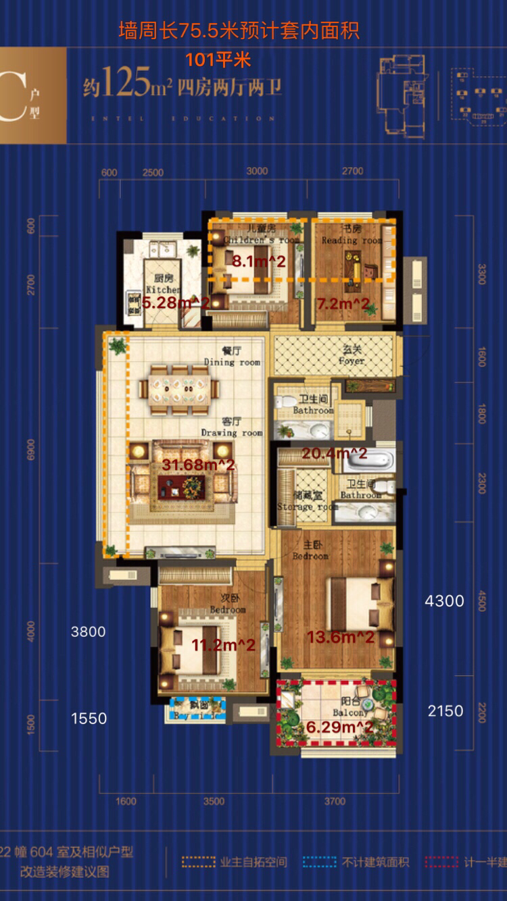

#家庭成员以及需求

## 概况

[CAD设计图地址](/)

## 需求

### 高频

1. 天天喜欢躺着看电视

   > 需要有个舒服的沙发，至少主次卧两个卧室支持有电视，需要挂墙架子以及支持电视节目源

2. 大部分时候早出晚归

   > 夜间照明不要太亮，希望能温和并且充足，更多希望使用led或者节能灯

3. 家里常驻2人老人隔段时间会过来，一两年内会要小孩。

   > 3个卧室必不可少，2个马桶以及洗漱与洗浴设施必不可少，

4. 衣服需要挂起来的很多，箱子很多

   > 需要存储空间充足，主卧需要衣帽间，并能支持行李箱等杂物

5. 夏天怕热，冬天怕冷

   > 基于需求可靠地取暖设备必不可少，需要地暖和中央空调

6. 网络设备较多

   > 需要建设全屋优质的有线/无线网络环境 **我来给出一个全屋网络解决方案** 

7. 不想洗碗

   > 需要洗碗机、垃圾处理器（鉴于我们经常会把下水道弄堵了）、小厨宝等厨房设施，先预留机位

### 低频

1. 偶尔想看美剧，延后架设全屋网络存储

   > 先假设网络，后期做数据存储设备，可以做事先预留

2. 周末几乎都会做饭，天气冷就不想做，会多油烟

   > 厨房需要必要电器，晚上做菜比较多，所以照明需要考虑。由于有过忘记关火的记录，所以要加强防火防烟的措施，

3. 偶尔会把工作带回家

   > 由于有四个卧室可以拿一个出来做成书房，不要做家具便于改动。

4. 每天都想做运动

   > 大部分时间停留在想，所以可以把阳台封闭后腾出来做运动空间，这样深度最好不要小于1.5m

5. 每周末会洗衣服、毛巾，两周会洗床单等

   > 有烘干机所以不用考虑太多晾晒问题。

6. 每周末都能看看书喝喝茶

   > 建议放在书房

7. 希望有一个浴缸

   > 可能不会常用

8. 可能会有朋友亲戚上门的情况

## 方案

* [电路设计方案](./解决方案/电路设计方案.md)
* [空调设计方案](./解决方案/空调设计方案.md)
* [地暖设计方案](./解决方案/地暖设计方案.md)
* [水路设计方案](./解决方案/水路设计方案.md)
* [弱电/WIFI设计方案](./解决方案/弱电WIFI设计方案.md)
* [厨房设计方案](./解决方案/厨房设计方案.md)
* [照明设计方案](./解决方案/照明设计方案.md)
* [衣柜设计方案](./解决方案/衣柜设计方案.md)
* 配色设计方案
* 软装设计方案

### 工具清单

